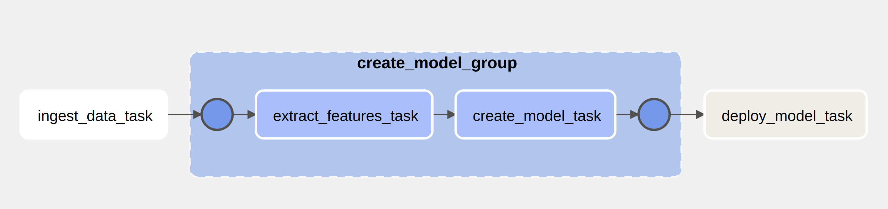
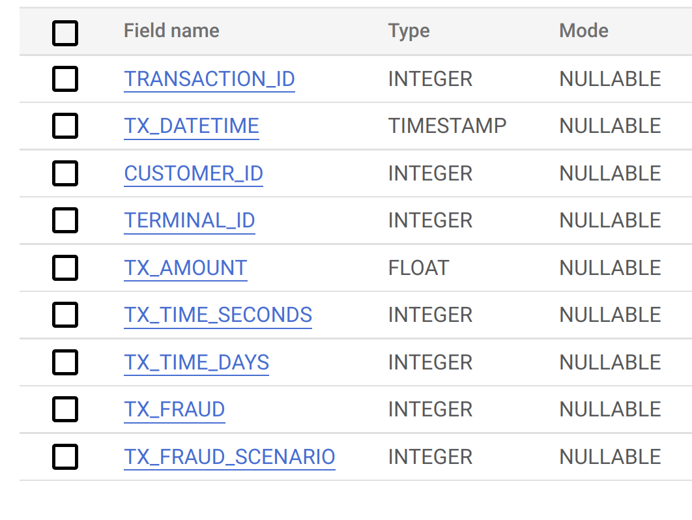
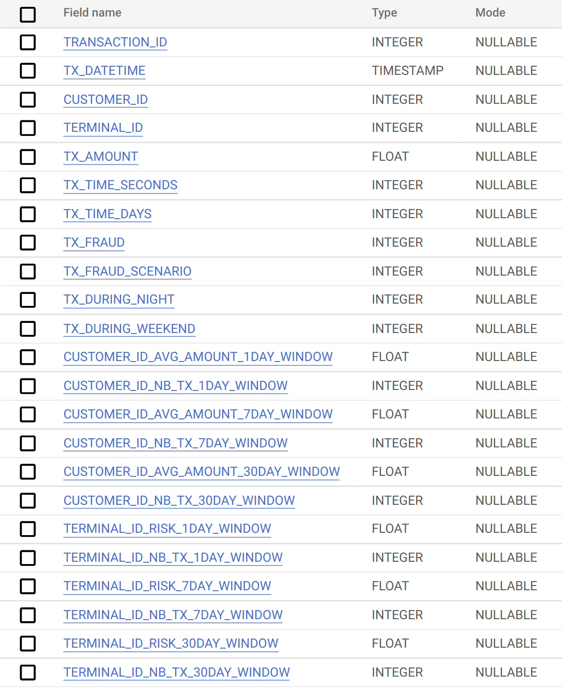
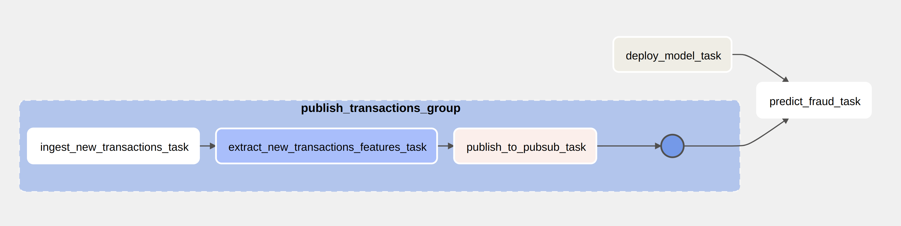

This project demonstrates an end-to-end solution in building a serverless scalable realtime credit fraud detection system using Google Cloud services. The project is inspired by the free book [Fraud Detection Handbook](https://github.com/Fraud-Detection-Handbook/fraud-detection-handbook)

It show case the data ingestion, data transformation, feature extraction, ML model building, model deployment, and real time model inference.

The entire pipeline is automated using Cloud Composer.

<!-- ### Architecure -->
#### Data Collection
The raw simulated transactions data mentioined in the Chapter 3 of the above book (available at https://github.com/Fraud-Detection-Handbook/simulated-data-raw) is used for building the model. 
This data represents transactions of 5000 customers at 10000 terminals for 183 days(which corresponds to a period from 2018/04/01 to 2018/09/30). It has a total of 1.75 million transactions. 

The same tool is used to generate 2 months of transactions past 2018/09/30 for prediction. These data are available as .pkl files and is uploaded to a GCS bucket. 

### Workflow
#### Model building Workflow
This comprises the airflow tasks to ingest, convert and store the data, build the ML model and deploy it into the cloud.

<!--  -->

##### Ingest Data Task (tasks/ingest_data.py)
This composer task ingest the data in the Cloud Storage to BigQuery. The task uses a batch Dataflow job (source/batch_data_ingestion.py) to transform the pkl files and load into the BigQuery using a airflow BeamRunPythonPipelineOperator. 

The schema of the ingested data is

##### Create Model Group (tasks/create_model.py)
This composer task group comprises of tasks for extracting and transforming into features from the raw data using a BigQueryInsertJobOperator(dags/tasks/scripts/extract_features.sql) and creates a XGBoost decison tree model using BQML script (dags/tasks/scripts/create_model.sql)

The transformed feature schema is 

##### Deploy Model Task (tasks/deploy_model.py)
This composer task extract the ML model from BigQuery, store it into the GCS and deploy it to a Vertex AI endpoint using a BashOperator (dags/tasks/scripts/deploy_model.sh)

#### Inference Workflow
This workflow comprises the tasks for real-time credit fraud detection of the newer transactions. To simulate the latest transactions data availability, the generated transaction data past the model trained date available at GCS is ingested to BigQuery and are extracted, transformed and published into a Pubsub topic. These features are subscribed by a streaming Dataflow job which invokes the deployed model for predicting each transaction for fraud. 
<!--  -->

##### Publish Transactions Group (dags/tasks/publish_transactions.py)
This task group uses the ingestion and feature extraction tasks like in the model creation workflow but works on the latest transactions data. The publish_to_pubsub task uses a PythonOperator (dags/tasks/scripts/publish_to_pubsub.py) to extract these transformed features from BigQuery and publish it to a PubSub topic.

##### Predict Fraud Task (dags/tasks/predict_fraud.py)
This task uses a BeamRunPythonPipelineOperator to run a steaming Dataflow job (source/streaming_ml_inference.py). The task retrieves the transformed transaction features from the PubSub and use it to invoke the deployed model to make predictions. On predicting a fraudulent transaction, the transaction details are pushed to a fraud notification topic. The non-fraudulent transactions are written into a BigQuery table. Also any transaction that results in error during the process is published to a error notification topic. 

These topics can be subscribed by other applications and visualization tools for monitoring, notifications and also for further analysis.

