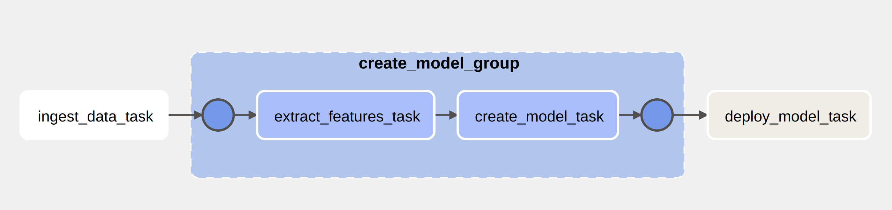

This project demonstrates an end-to-end solution in building a serverless scalable realtime credit fraud detection system using Google Cloud services. The project is inspired by the free book [Fraud Detection Handbook](https://github.com/Fraud-Detection-Handbook/fraud-detection-handbook)

It show case the data ingestion, data transformation, feature extraction, ML model building, model deployment, and real time model inference.

The entire pipeline is automated using Cloud Composer.

### Architecure

### Workflow
#### Model building Workflow

#### Inference Workflow
